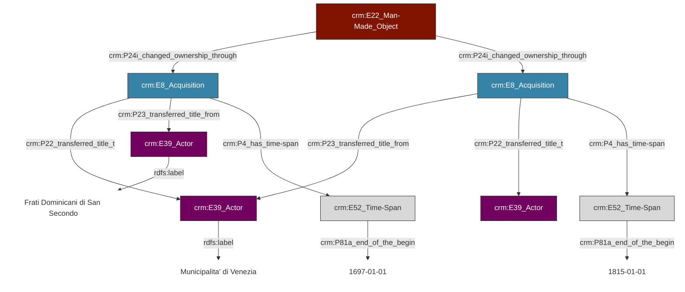

```mermaid
graph TB;
  bw[crm:E22_Man-Made_Object]
  acquisition1[crm:E8_Acquisition]
  acquisition2[crm:E8_Acquisition]
  owner3[crm:E39_Actor]
  owner2[crm:E39_Actor]
  owner1[crm:E39_Actor]
  owner1_lbl[Frati Dominicani di San Secondo]
  owner2_lbl[Municipalita' di Venezia]
  acquisition1_date[crm:E52_Time-Span]
  acquisition2_date[crm:E52_Time-Span]
  acquisition1_date_lbl[1697-01-01]
  acquisition2_date_lbl[1815-01-01]

  bw--crm:P24i_changed_ownership_through-->acquisition1
  bw--crm:P24i_changed_ownership_through-->acquisition2

  acquisition1--crm:P22_transferred_title_to-->owner2
  acquisition1--crm:P23_transferred_title_from-->owner1
  acquisition1--crm:P4_has_time-span--->acquisition1_date

  acquisition2--crm:P23_transferred_title_from-->owner2
  acquisition2--crm:P22_transferred_title_to-->owner3
  acquisition2--crm:P4_has_time-span--->acquisition2_date

  acquisition1_date--crm:P81a_end_of_the_begin-->acquisition1_date_lbl

  acquisition2_date--crm:P81a_end_of_the_begin-->acquisition2_date_lbl

  owner1--rdfs:label-->owner1_lbl
  owner2--rdfs:label-->owner2_lbl


  style bw fill:#801401,stroke:#333,color:#fff

  style acquisition1 fill:#3783A8,stroke:#333,color:#fff
  style acquisition2 fill:#3783A8,stroke:#333,color:#fff

  style owner1 fill:#72005F,stroke:#333,color:#fff
  style owner2 fill:#72005F,stroke:#333,color:#fff
  style owner3 fill:#72005F,stroke:#333,color:#fff


  style acquisition1_date fill:#D8D8D8,stroke:#333
  style acquisition2_date fill:#D8D8D8,stroke:#333

  style acquisition1_date_lbl fill:#fff,stroke:#fff
  style acquisition2_date_lbl fill:#fff,stroke:#fff
  style owner1_lbl fill:#fff,stroke:#fff
  style owner2_lbl fill:#fff,stroke:#fff
```