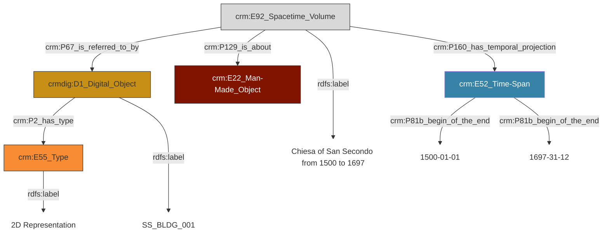

```mermaid
graph TD;
  e92[crm:E92_Spacetime_Volume] -- crm:P67_is_referred_to_by --> d1[crmdig:D1_Digital_Object]
   -- crm:P2_has_type --> 2d[crm:E55_Type] -- rdfs:label --> lbl2(2D Representation)

  d1 -- rdfs:label --->  lbl3(SS_BLDG_001)

  e92 -- crm:P129_is_about --> bldg[crm:E22_Man-Made_Object]
  e92 -- rdfs:label ---> lbl1(Chiesa of San Secondo from 1500 to 1697)
  e92 -- crm:P160_has_temporal_projection --> date[crm:E52_Time-Span] 
  
  date -- crm:P81b_begin_of_the_end --> date_lbl1(1500-01-01)
  date -- crm:P81b_begin_of_the_end --> date_lbl2(1697-31-12)

  style e92 fill:#D8D8D8,stroke:#333
  style d1 fill:#C78F15,stroke:#333
  style 2d fill:#F88C34,stroke:#333
  style lbl1 fill:#fff,stroke:#fff
  style lbl2 fill:#fff,stroke:#fff
  style lbl3 fill:#fff,stroke:#fff
  style date fill:#3783A8,color:#fff
  style date_lbl1 fill:#fff,stroke:#fff
  style date_lbl2 fill:#fff,stroke:#fff
  style bldg fill:#801401,stroke:#333,color:#fff
```