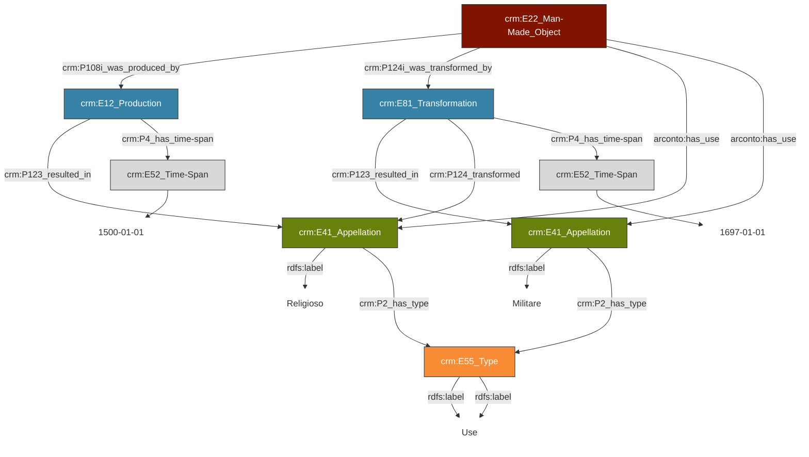

```mermaid
graph TD;
  bw[crm:E22_Man-Made_Object]
  construction[crm:E12_Production] 
  transformation[crm:E81_Transformation]
  appellation1[crm:E41_Appellation]
  appellation2[crm:E41_Appellation]
  construction_date[crm:E52_Time-Span]
  transformation_date[crm:E52_Time-Span]
  type[crm:E55_Type]
  appellation1_lbl[Religioso]
  appellation2_lbl[Militare]
  type_lbl[Use]
  transformation_date_eob[1697-01-01]
  construction_date_eob[1500-01-01]

  bw--crm:P108i_was_produced_by-->construction
  bw--crm:P124i_was_transformed_by-->transformation

    bw--arconto:has_use-->appellation1
  bw--arconto:has_use-->appellation2

  construction--crm:P123_resulted_in--->appellation1
  transformation--crm:P123_resulted_in--->appellation2
  transformation--crm:P124_transformed-->appellation1

  appellation1--rdfs:label-->appellation1_lbl
  appellation2--rdfs:label-->appellation2_lbl

  appellation1--crm:P2_has_type--->type--rdfs:label-->type_lbl
  appellation2--crm:P2_has_type--->type--rdfs:label-->type_lbl


  transformation--crm:P4_has_time-span-->transformation_date
  construction--crm:P4_has_time-span-->construction_date

  transformation_date-->transformation_date_eob
  construction_date-->construction_date_eob


  style appellation1_lbl fill:#fff,stroke:#fff
  style appellation2_lbl fill:#fff,stroke:#fff
  style type_lbl fill:#fff,stroke:#fff
  style transformation_date_eob fill:#fff,stroke:#fff
  style construction_date_eob fill:#fff,stroke:#fff

  style type fill:#F88C34,color:#fff,stroke:#333

  style transformation fill:#3783A8,stroke:#333,color:#fff
  style construction fill:#3783A8,stroke:#333,color:#fff

  style bw fill:#801401,stroke:#333,color:#fff
  style appellation1 fill:#68810C,stroke:#333,color:#fff
  style appellation2 fill:#68810C,stroke:#333,color:#fff

  style construction_date fill:#D8D8D8,stroke:#333
  style transformation_date fill:#D8D8D8,stroke:#333
```