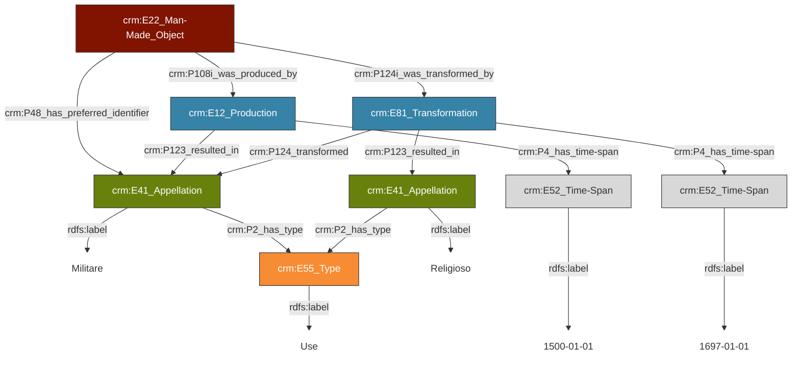

```mermaid
graph TD;
  bw[crm:E22_Man-Made_Object]--crm:P48_has_preferred_identifier --> appellation1[crm:E41_Appellation]

  bw --crm:P108i_was_produced_by--> construction[crm:E12_Production] -- crm:P123_resulted_in --> appellation1

  construction --crm:P4_has_time-span--> construction_date[crm:E52_Time-Span] --rdfs:label---> lbl6[1500-01-01]

  appellation1--rdfs:label-->lbl1[Militare]
  appellation1--crm:P2_has_type-->type1[crm:E55_Type]--rdfs:label-->lbl2[Use]

  bw -- crm:P124i_was_transformed_by --> transformation1[crm:E81_Transformation] -- crm:P124_transformed --> appellation1

  transformation1 -- crm:P123_resulted_in --> appellation2[crm:E41_Appellation] --rdfs:label --> lbl3[Religioso]

  transformation1--crm:P4_has_time-span--> transformation1_date[crm:E52_Time-Span] --rdfs:label---> lbl5[1697-01-01]


  appellation2 -- crm:P2_has_type --> type1[crm:E55_Type]

  style lbl1 fill:#fff,stroke:#fff
  style lbl2 fill:#fff,stroke:#fff
  style lbl3 fill:#fff,stroke:#fff
  style lbl6 fill:#fff,stroke:#fff
  style lbl5 fill:#fff,stroke:#fff

  style type1 fill:#F88C34,color:#fff,stroke:#333

  style transformation1 fill:#3783A8,stroke:#333,color:#fff
  style construction fill:#3783A8,stroke:#333,color:#fff

  style bw fill:#801401,stroke:#333,color:#fff
  style appellation1 fill:#68810C,stroke:#333,color:#fff
  style appellation2 fill:#68810C,stroke:#333,color:#fff

  style construction_date fill:#D8D8D8,stroke:#333
  style transformation1_date fill:#D8D8D8,stroke:#333
```
